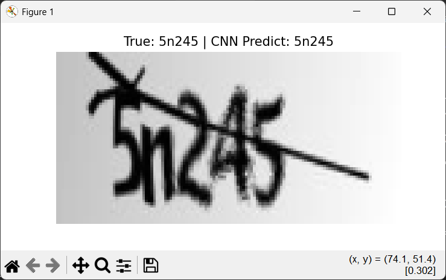

# 🤖 CNN CAPTCHA Recognition

> A lightweight PyTorch-based project for recognizing alphanumeric CAPTCHAs using Convolutional Neural Networks (CNN).

## 📌 Features

- Custom CNN model architecture
- CAPTCHA dataset loading and augmentation
- Training & validation pipeline
- Visualization of predictions
- Easy to extend or integrate

---

## 🧠 Example Prediction

 <!-- Заміни шлях, якщо потрібно -->

---

## 🚀 Getting Started

### 1. Clone the repository

```bash
git clone https://github.com/dmytrogetsko/cnn-captcha-recognition
cd cnn-captcha-recognition
```

### 2. (Optional) Create virtual environment

```bash
python -m venv venv
# Windows
venv\Scripts\activate
# Linux/macOS
source venv/bin/activate
```

### 3. Install dependencies

```bash
pip install -r requirements.txt
```

## 🧾 Project Structure

```bash
cnn-captcha-recognition/
│
├── core/
│   ├── dataset.py       # Custom dataset class
│   └── model.py         # CNN architecture
│
├── utils/
│   └── validation.py    # Prediction visualization
│
├── main.py              # Training pipeline entrypoint
├── requirements.txt     # Dependencies
└── README.md            # You are here
```

## ⚙️ Usage
### Train the model

```bash
python main.py
```
> Make sure your dataset is properly loaded in core/dataset.py. Adjust paths and batch sizes as needed.

**Example of a prediction result:**


## 📸 Dataset
The model is designed to work with datasets of CAPTCHA images labeled by filename or metadata.

- Supported CAPTCHA length - 5 symobols; could be modified in `main.py`:
```python
...
13 | captcha_length = 5
...
```
- Supported formats: PNG, JPG
- Recommended size: 200x50 px (adjustable)

You can modify or extend the dataset class in `core/dataset.py`.
